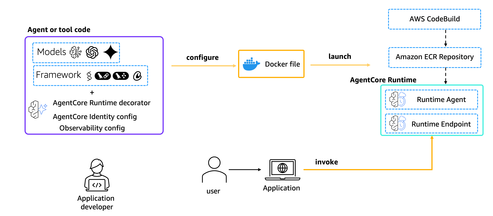

# Amazon Bedrock AgentCore Runtime Lab

Deploy production-ready AI agents in minutes with Amazon Bedrock AgentCore Runtime.

## What is AgentCore?

Amazon Bedrock AgentCore is a suite of services that simplifies deploying AI agents to production. Instead of weeks configuring infrastructure, you get production-ready agents with just 2 commands.

### AgentCore Services

- **AgentCore Runtime** ⭐ - Serverless execution with auto-scaling and session management
- **AgentCore Identity** - Secure credential management for API keys and tokens  
- **AgentCore Memory** - State persistence and conversation history
- **AgentCore Code Interpreter** - Secure code execution sandbox
- **AgentCore Browser** - Cloud browser automation
- **AgentCore Gateway** - API management and tool discovery
- **AgentCore Observability** - Monitoring, tracing, and debugging

## This Lab: AgentCore Runtime

This project demonstrates **AgentCore Runtime** - the core service that handles:

- Serverless agent execution
- Automatic scaling based on demand
- Session isolation in dedicated containers
- Container orchestration and lifecycle management



## Any Agent Framework Support

AgentCore Runtime supports multiple AI agent frameworks beyond Strands Agents:

- **Strands Agents** - Featured in this lab
- **LangGraph** - Example included in `langgraph/` folder
- **Google ADK** - Agent Development Kit
- **OpenAI Agents SDK** - OpenAI's agent framework
- **Microsoft AutoGen** - Multi-agent conversation framework
- **CrewAI** - Multi-agent collaboration platform

For complete examples and integration patterns, see the [Any Agent Framework Guide](https://docs.aws.amazon.com/bedrock-agentcore/latest/devguide/using-any-agent-framework.html).

## Any Foundation Model Support

AgentCore Runtime supports any foundation model provider: **Amazon Bedrock, OpenAI, Anthropic Claude, Google Gemini,** and others through standard API integrations (see [`my_agent_anymodel.py`](my_agent_anymodel.py) example).

For complete model integration examples, see the [Any Foundation Model Guide](https://docs.aws.amazon.com/bedrock-agentcore/latest/devguide/using-any-model.html).

## Session Management

AgentCore Runtime provides **session isolation** to maintain conversation context across multiple invocations:

- **Session Duration**: Up to 8 hours maximum lifetime
- **Idle Timeout**: 15 minutes (900 seconds) by default  
- **Context Preservation**: Maintains state between invocations using the same session ID
- **Isolation**: Each session runs in its own dedicated microVM for security

Sessions help preserve conversation context, allowing agents to provide coherent responses that build on previous interactions.

## Quick Start

1. **Install dependencies**
```bash
pip install -r requirements.txt
```

2. **Test locally**
```bash
python my_agent.py

# In another terminal, test with curl
curl -X POST http://localhost:8080/invocations \
  -H "Content-Type: application/json" \
  -d '{
    "prompt": "Hello world!"
  }'
```

3. **Deploy to production**
```bash
agentcore configure -e my_agent.py
agentcore launch
```

4. **Invoke programmatically**
```bash
# Using command line arguments
python invoke_agent.py "AGENT_ARN" "Your prompt here"

# Using environment variables
export AGENT_ARN="your-agent-arn"
python invoke_agent.py
```

## Response Streaming

AgentCore Runtime supports streaming responses for real-time user experiences. The streaming agent uses `async/await` and `yield` to stream responses as they're generated.

Example streaming agent ([`my_agent_streaming.py`](my_agent_streaming.py)):
```python
@app.entrypoint
async def agent_invocation(payload):
    user_message = payload.get("prompt", "Hello!")
    stream = agent.stream_async(user_message)
    async for event in stream:
        yield (event)
```

Test streaming responses:
```bash
# Deploy streaming agent
agentcore configure -e my_agent_streaming.py
agentcore launch

# Test streaming
python invoke_streaming_agent.py "STREAMING_AGENT_ARN" "Tell me a story"
```

5. **Test session management**
```bash
# Demonstrate session-aware conversations
python session_example.py "AGENT_ARN"

# Or using environment variables
export AGENT_ARN="your-agent-arn"
python session_example.py
```

For detailed programmatic invocation, see the [Invoke Agent Programmatically Guide](https://docs.aws.amazon.com/bedrock-agentcore/latest/devguide/runtime-get-started-toolkit.html#invoke-programmatically).

## What's Included

- [`my_agent.py`](my_agent.py) - Basic agent with AgentCore Runtime integration
- [`my_agent_anymodel.py`](my_agent_anymodel.py) - Agent using Anthropic Claude with API key authentication
- [`my_agent_streaming.py`](my_agent_streaming.py) - Streaming agent example
- [`invoke_agent.py`](invoke_agent.py) - Script to invoke deployed agent programmatically
- [`invoke_streaming_agent.py`](invoke_streaming_agent.py) - Script to test streaming responses
- [`session_example.py`](session_example.py) - Demonstrates session-aware conversations
- [`langgraph/`](langgraph/) - LangGraph agent example with invoke script
- [`requirements.txt`](requirements.txt) - Required packages for AgentCore and Strands Agents
- [`.bedrock_agentcore.yaml`](.bedrock_agentcore.yaml) - AgentCore configuration
- [`.bedrock_agentcore/`](.bedrock_agentcore/) - Generated deployment artifacts

This project was created following the [AgentCore Starter Toolkit Guide](https://docs.aws.amazon.com/bedrock-agentcore/latest/devguide/runtime-get-started-toolkit.html).

## Key Benefits

- **15 minutes** from code to production endpoint
- **Serverless** - no infrastructure management
- **Auto-scaling** - handles traffic spikes automatically
- **Session-aware** - maintains conversation context
- **Built-in security** - AWS security best practices included

## Prerequisites

- AWS account with appropriate permissions
- Python 3.10+ environment
- AWS CLI configured

For detailed permission requirements, see the [AgentCore Runtime Permissions Guide](https://docs.aws.amazon.com/bedrock-agentcore/latest/devguide/runtime-permissions.html).

## Clean Up

If you no longer want to host the agent in the AgentCore Runtime, use the destroy command to delete the AWS resources that the starter toolkit created for you.

```bash
agentcore destroy
```

## Next Steps

Ready to configure and deploy? You'll need:
- IAM role for deployment
- API keys configured in AgentCore Identity

*This lab focuses on AgentCore Runtime. For complete production deployments, you'll also use AgentCore Identity for secure credential management.*
