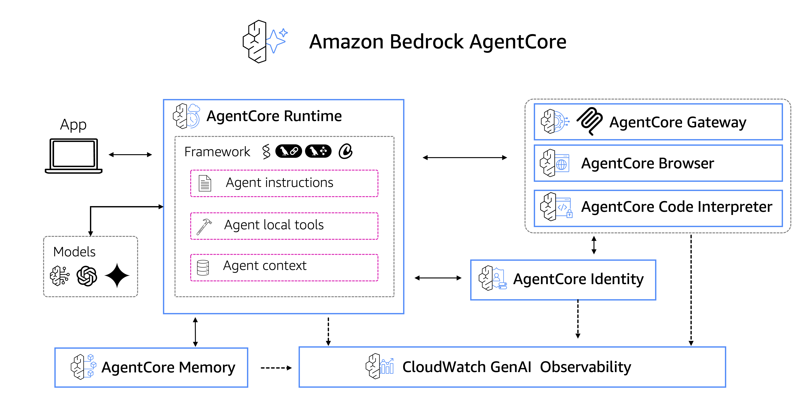

# starting with Amazon Bedrock AgentCore

<div align="center">
  
  [](LICENSE)
  [](https://python.org)
  [](https://aws.amazon.com/bedrock/)
  
  
  <br>
  <p><em>Bring AI agents into production in minutes</em>
  </p>
   <p>⭐ Star this repository</p>
  
</div>

<div align="center">

This repository contains hands-on labs demonstrating the capabilities of [Amazon Bedrock AgentCore](https://docs.aws.amazon.com/bedrock-agentcore/latest/devguide/what-is-bedrock-agentcore.html), a suite of services that enables you to deploy and operate highly effective AI agents securely at scale.

## What is Amazon Bedrock AgentCore?

Amazon Bedrock AgentCore enables developers to accelerate AI agents into production with enterprise-grade scale, reliability, and security. AgentCore provides composable services that work with popular open-source frameworks and any model, eliminating the choice between open-source flexibility and enterprise requirements.

### AgentCore Services Overview



| Service | Purpose | Key Features |
|---------|---------|--------------|
| **AgentCore Runtime** | Serverless execution | Auto-scaling, session management, container orchestration |
| **AgentCore Identity** | Credential management | API keys, OAuth tokens, secure vault |
| **AgentCore Memory** | State persistence | Short-term memory, long-term storage |
| **AgentCore Gateway** | API management | Tool discovery, service integration |
| **AgentCore Code Interpreter** | Code execution | Secure sandbox, data analysis |
| **AgentCore Browser** | Web interaction | Cloud browser, auto-scaling |
| **AgentCore Observability** | Monitoring | Tracing, dashboards, debugging |

## Labs Overview

| 📓 Notebook | 🎯 Focus & Key Learning | ⏱️ Time | 📊 Level |
|-------------|------------------------|----------|----------|
| **01 - [Amazon Bedrock AgentCore Runtime](./01-agentcore-runtime/)** | Text embeddings and PDF processing - Document chunking, embeddings generation, FAISS vector store operations | 10 min |  | 
| **02 - [Amazon Bedrock AgentCore Memory](./02-agentcore-memory/)** | Visual search capabilities - Image embeddings, multimodal search, natural language image queries | 10 min |  | 
| **03 - [Amazon Bedrock AgentCore Gateway](./03-agentcore-gateway/)** | Production database setup - PostgreSQL vector operations, pgvector extension, scalable similarity search | 10 min |  | 

---

### Amazon Bedrock AgentCore Runtime
**Focus**: [Serverless AI Agent Deployment](https://docs.aws.amazon.com/bedrock-agentcore/latest/devguide/runtime-how-it-works.html)


Deploy production-ready AI agents with just 2 commands using AgentCore Runtime. This lab demonstrates:
- Serverless agent deployment with auto-scaling
- Session management and isolation
- Built-in security and authentication
- Integration with Strands Agents framework

**Key Learning**: Transform prototype agents into production-ready services in minutes, not weeks.

### Amazon Bedrock AgentCore Memory
**Focus**: [Intelligent Memory Capabilities](https://docs.aws.amazon.com/bedrock-agentcore/latest/devguide/memory.html)


Add context-aware memory to AI agents using AgentCore Memory. This lab covers:
- Short-term memory for conversation context
- Long-term memory for user preferences
- Cross-session knowledge retention
- Personalized agent experiences

**Key Learning**: Build agents that remember and learn from interactions to provide more intelligent responses.

### Amazon Bedrock AgentCore Gateway
**Focus**: [Tool Integration and Discovery](https://docs.aws.amazon.com/bedrock-agentcore/latest/devguide/gateway.html)


>Based on [Integrate Amazon Bedrock AgentCore Gateway with Amazon Bedrock AgentCore Runtime](https://github.com/awslabs/amazon-bedrock-agentcore-samples/tree/main/01-tutorials/02-AgentCore-gateway/04-integration/01-runtime-gateway)

Transform existing services into agent-compatible tools using AgentCore Gateway. This lab demonstrates:
- Converting Lambda functions to MCP tools
- Multi-target gateway configuration
- AWS IAM authentication for secure access
- Tool discovery and pagination

**Key Learning**: Integrate existing enterprise resources as agent tools without custom development.

## Getting Started

Each lab includes:
- **Prerequisites**: Required setup and dependencies
- **Step-by-step deployment**: Automated infrastructure setup
- **Sample interactions**: Real-world usage examples
- **Code explanations**: Detailed implementation walkthrough
- **Cleanup instructions**: Resource removal

## Key Benefits of AgentCore

### Traditional vs AgentCore Deployment

| Traditional Deployment | AgentCore Deployment |
|----------------------|---------------------|
| ❌ 3+ weeks setup | ✅ 15 minutes |
| ❌ Docker + Kubernetes | ✅ Serverless |
| ❌ Manual scaling | ✅ Auto-scaling |
| ❌ Complex security | ✅ Built-in security |
| ❌ DevOps expertise required | ✅ 2 commands |

### Enterprise-Grade Features

- **Security**: Built-in authentication, session isolation, and credential management
- **Scalability**: Automatic scaling based on demand with no infrastructure management
- **Reliability**: Versioned deployments with rollback capabilities
- **Observability**: Comprehensive monitoring, tracing, and debugging tools
- **Framework Agnostic**: Works with LangGraph, CrewAI, Strands Agents, and custom frameworks

## Prerequisites

Before starting any lab, ensure you have:
- AWS Account with appropriate permissions
- Python 3.10+ installed
- AWS CLI configured
- Basic understanding of AI agents and AWS services

## Resources

### Documentation
- [What is Amazon Bedrock AgentCore?](https://docs.aws.amazon.com/bedrock-agentcore/latest/devguide/what-is-bedrock-agentcore.html)
- [AgentCore Runtime How It Works](https://docs.aws.amazon.com/bedrock-agentcore/latest/devguide/runtime-how-it-works.html)
- [AgentCore Memory Guide](https://docs.aws.amazon.com/bedrock-agentcore/latest/devguide/memory.html)
- [AgentCore Gateway Documentation](https://docs.aws.amazon.com/bedrock-agentcore/latest/devguide/gateway.html)
- [Programmatic Agent Invocation](https://docs.aws.amazon.com/bedrock-agentcore/latest/devguide/runtime-get-started-toolkit.html#invoke-programmatically)

### Tutorials
- [Deploy Production AI Agents in 2 Commands](https://dev.to/aws/deploy-production-ai-agents-with-amazon-bedrock-agentcore-in-2-commands-obg)

### Code Examples
- [AWS Labs AgentCore Samples](https://github.com/awslabs/amazon-bedrock-agentcore-samples/)

## Lab Structure

```
test-ga/
├── lab01/          # AgentCore Runtime - Basic deployment
├── lab02/          # AgentCore Memory - Context-aware agents  
├── lab03/          # AgentCore Gateway - Tool integration
└── README.md       # This overview
```

Each lab is self-contained with its own README, code samples, and infrastructure templates.

---

**Ready to deploy production AI agents?** Start with [01-agentcore-runtime](./01-agentcore-runtime/) to learn the fundamentals of AgentCore Runtime.

---

## 🇻🇪🇨🇱 ¡Gracias!

[Dev.to](https://dev.to/elizabethfuentes12) [Linkedin](https://www.linkedin.com/in/lizfue/) [GitHub](https://github.com/elizabethfuentes12/) [Twitter](https://twitter.com/elizabethfue12) [Instagram](https://www.instagram.com/elifue.tech) [Youtube](https://www.youtube.com/channel/UCr0Gnc-t30m4xyrvsQpNp2Q)
[Linktr](https://linktr.ee/elizabethfuentesleone)
---

## 📄 License

This library is licensed under the MIT-0 License. See the [LICENSE](LICENSE) file for details.
